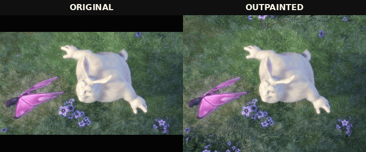

# ComfyUI MiniMax H3 Video Outpaint



*Frame-synchronized original and 9:12 outpainted output.*

Prompt-free MiniMax H3 video outpainting for ComfyUI. The node expands a source video to a portrait canvas while preserving temporal continuity across long clips.

## Requirements

- ComfyUI with native MiniMax H3 support
- MiniMax H3 FL2VA model
- MiniMax-compatible Qwen3-VL text encoder
- MiniMax H3 video VAE

## Installation

```bash
cd ComfyUI/custom_nodes
git clone git@github.com:TwoAbove/ComfyUI-H3VideoOutpaint.git
```

Restart ComfyUI after cloning. No additional Python packages are required.

## Workflow

```text
Load Video ───────────────┐
Load H3 MODEL ─┐          │
Load H3 CLIP ──┼─> MiniMax H3 Video Outpaint (Prompt Free) ─> Save Video
Load H3 VAE ───┘
```

The node does not accept a prompt. Connect the H3 model, text encoder, video VAE, and source `VIDEO`, then route the output directly to `Save Video`.

For lower VRAM use, route the model through:

- `MiniMax H3 Low VRAM Attention`: 4 head chunks
- `MiniMax H3 Chunk FeedForward`: 4 chunks with a 4096-token threshold

## Settings

- `skip_first_frames`: Frames to skip at the beginning of the source.
- `frame_load_cap`: Maximum number of source frames. `0` processes the remainder of the video.
- `target_aspect`: Uses the source aspect or expands toward a 9:12 portrait canvas.
- `generation_megapixels`: Sampling-canvas budget. `0` uses the full selected output resolution.
- `minimum_source_megapixels`: Minimum source area retained while fitting the target aspect.
- `max_upscale`: Maximum linear resize from the H3 canvas to the output.
- `temporal_window_frames`: Transformer context size. `auto` selects a bounded window from the canvas dimensions.
- `seed`, `steps`, `sampler_name`, `scheduler`: Standard sampling controls.

Recommended starting values are `generation_megapixels=1.0`, `minimum_source_megapixels=0.7`, `max_upscale=1.5`, `steps=20`, sampler `res_multistep`, scheduler `simple`, and temporal window `auto`.

## Processing

The source is cropped to H3's spatial grid and outpainted chronologically in overlapping windows. Each completed overlap anchors the next window. The assembled result is decoded once and saved at the source frame rate.

H3 requires frame counts of the form `17k+5`. When alignment adds frames beyond the source duration, those frames are generated as a continuation.

## Example workflows

- `example_workflows/MiniMax H3 Video Outpaint - Prompt Free.json`
- `example_workflows/MiniMax H3 Video Outpaint - API.json`

Copy `examples/big_buck_bunny_source.mp4` to `ComfyUI/input` before running either workflow.

## Example media

- [`big_buck_bunny_source.mp4`](examples/big_buck_bunny_source.mp4)
- [`big_buck_bunny_outpaint.mp4`](examples/big_buck_bunny_outpaint.mp4)

The excerpt is from *Big Buck Bunny*, licensed under [CC BY 3.0](https://creativecommons.org/licenses/by/3.0/):

> © 2008 Blender Foundation / [www.bigbuckbunny.org](https://peach.blender.org/)
