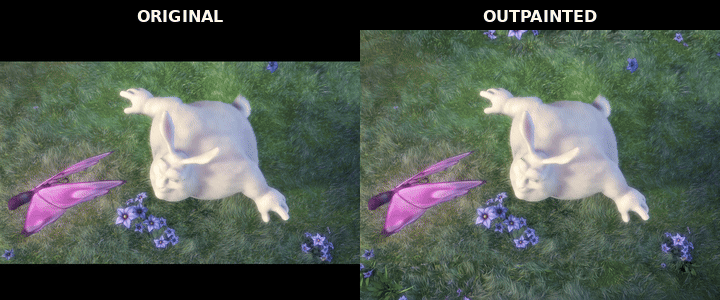

# ComfyUI MiniMax H3 Video Outpaint



*Frame-synchronized original and 9:12 outpainted output.*

MiniMax H3 video outpainting for ComfyUI. The node expands a source video to a portrait canvas while preserving temporal continuity across long clips.

## Requirements

- ComfyUI with native MiniMax H3 support and [Comfy-Org/ComfyUI#16184](https://github.com/Comfy-Org/ComfyUI/pull/16184) (positioned FL2VA keyframes), or a checkout that includes it
- MiniMax H3 FL2VA model
- MiniMax-compatible Qwen3-VL text encoder
- MiniMax H3 video VAE
- MiniMax H3 audio VAE

## Installation

```bash
cd ComfyUI/custom_nodes
git clone git@github.com:TwoAbove/ComfyUI-H3VideoOutpaint.git
```

Restart ComfyUI after cloning. No additional Python packages are required.

## Workflow

```text
Load Video ───────────────┐
Load H3 MODEL ─┐          │
Load H3 CLIP ──┤          │
Load H3 VIDEO VAE ────────┼─> MiniMax H3 Video Outpaint ─> Save Video
Load H3 AUDIO VAE ────────┘
```

The prompt is optional. Each window shows its opening source frame to the text encoder, so an empty prompt works; a prompt steers what the bands contain and does not correct their tone. Write it as a MiniMax H3 scene description (setting, lighting, subjects, camera) and name what is beyond each edge, for example "a purple wall above, a wooden floor below". Do not write that the frame "continues above and below": on uniform, texture-like scenes the model then repeats the source in the bands. The model is CFG-distilled and renders the bands somewhat warmer and more saturated than soft footage regardless of the prompt. Source audio is preserved, used as H3 context, and continued when frame alignment extends the video. Silent sources remain silent.

For lower VRAM use, route the model through:

- `MiniMax H3 Low VRAM Attention`: 4 head chunks
- `MiniMax H3 Chunk FeedForward`: 4 chunks with a 4096-token threshold

## Settings

- `skip_first_frames`: Frames to skip at the beginning of the source.
- `frame_load_cap`: Maximum number of source frames. `0` processes the remainder of the video.
- `target_aspect`: Keeps the source aspect or expands toward a 9:12 portrait canvas.
- `generation_megapixels`, `max_upscale`, `minimum_source_megapixels`: Bound how far the canvas expands toward the target aspect. A candidate canvas is allowed when its area is at most `generation_megapixels` scaled by `max_upscale` per axis and the source would still cover `minimum_source_megapixels` on a budget-sized canvas. The allowed canvas closest to the target aspect (smallest on ties) is sampled at full output resolution; `generation_megapixels=0` removes the area bound.
- `temporal_window_frames`: Transformer context per denoiser call. `auto` picks the largest window up to 107 frames that fits the canvas.
- `source_pixels`: `exact` composites the real source pixels over the decode with a 16 px fade at each band edge and a per-frame RGB tone match at the seam. `decoded` saves the whole-frame VAE decode, so the seam is decoder-continuous but the source is a VAE reconstruction.
- `seed`, `steps`, `sampler_name`, `scheduler`: Standard sampling controls. Use a deterministic sampler such as `res_multistep`; stochastic samplers (`er_sde`, `euler_ancestral`) leave noise in each window's bands that the next window inherits, and it compounds into blocky texture over long clips.

Recommended starting values are `generation_megapixels=1.0`, `minimum_source_megapixels=0.7`, `max_upscale=1.5`, `steps=20`, sampler `res_multistep`, scheduler `simple`, and temporal window `auto`.

## Processing

The source keeps every row and column down to H3's 16 px latent grid on the axis that gains bands; only the fixed axis is cropped to the 32 px canvas grid. Every temporal window gets the source three ways: as hard-preserved target latents, as spatially positioned FL2VA keyframe rows (the 2x2-patch interior of the pinned rows), and as the `<Picture 1>` vision input of its Qwen text context. The outermost latent row on each band-facing edge is left free: the VAE folds whatever lies past the source edge into that row, and pinning it produces an image border at the seam. Windows are sampled sequentially; each completed overlap becomes hard input and a keyframe for the next window, and every window's generated latents are round-tripped through the video VAE before they are committed so the handoff is always an encoder latent like the source. The assembled latent is decoded once. With `source_pixels=exact`, the per-frame RGB step between the real source rows and the generated rows at each seam is ramped out across the band, and the source pixels are composited back with a smoothstep fade over the free edge row. Output is saved at the source frame rate.

H3 requires frame counts of the form `17k+5`. When alignment adds frames beyond the source duration, those frames are generated as a continuation.

## Example workflows

- `example_workflows/MiniMax H3 Video Outpaint.json`
- `example_workflows/MiniMax H3 Video Outpaint - API.json`

Copy `examples/big_buck_bunny_source.mp4` to `ComfyUI/input` before running either workflow.

## Example media

- [`big_buck_bunny_source.mp4`](examples/big_buck_bunny_source.mp4)
- [`big_buck_bunny_outpaint.mp4`](examples/big_buck_bunny_outpaint.mp4)

The excerpt is from *Big Buck Bunny*, licensed under [CC BY 3.0](https://creativecommons.org/licenses/by/3.0/):

> © 2008 Blender Foundation / [www.bigbuckbunny.org](https://peach.blender.org/)
